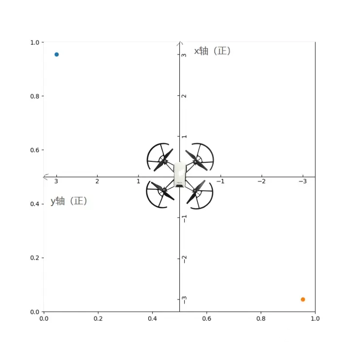
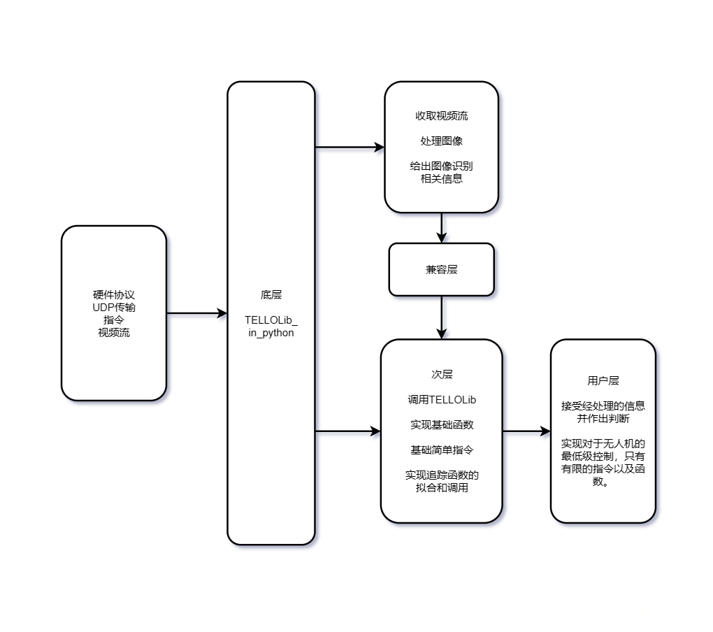

# Tellolib_in_python

为了实现基础的飞行控制，我们采用层级式编码，阅读 `TELLO SDK` 文档易知，飞行器均通过`udp` 协议进行传输命令，从而实现飞行。

对此，TELLOLib_in_python即是最基础的一层，为了易于控制于调整，我在参考了`djitellopy`的简洁的控制模式后，进行编码，实现了从`UDP`指令到函数调用的转化，将类实例化后具体相关调用如下：

|相关调用：|meaning|
|-|-|
|comman()|开启command模式，无参数|
|takeoff()|起飞，无参数|
|land()|着陆，无参数|
|streamon()|开启视频流，无参数|
|streamoff()|关闭视频流，无参数|
|emergency()|紧急模式，立刻停止电机转动，无参数|
|up(int)|向上升 厘米，20-500|
|down(int)|向下降落 厘米，20-500|
|left(int)|同理|
|right(int)|同理|
|forward(int)|同理|
|back(int)|同理|
|cw(int)|顺时针旋转 °，1-3600|
|cww(int)|逆时针旋转 °，1-3600|
|flip(l/r/f/b)|向left/right/front/back翻转，需要电量充足，否则响应error|
|go(x: int,y: int,z: int,speed: int)|走向坐标点（x,y,z）以speed|
|curve( x1: int, y1: int, z1: int, x2: int, y2: int, z2: int, speed: int)|以弧线经过（x1,y1,z1）到达（x2,y2,z2）以线速度speed|
|rc_control(a: int, b: int, c: int, d: int)|a,左右；b前后；c上下；d旋转；-100~100，以坐标系为准|
|set_wifi(ssid: str, passwrd: str)|无需多言|
|get_speed()|无需多言|
|get_battery()|无需多言|
|get_time()|获取电机运转时间（s）|
|get_height()|无需多言|
|get_temp()|无需多言|
|get_attitude()|获取 IMU 三轴姿态数据|
|get_baro()|获取气压计高度(m)|
|get_acceleration()|获取 IMU 三轴加速度数据(0.001g)|
|get_tof()|获取 ToF 的高度值(cm)|
|get_wifi()|获得 Wi-Fi 信噪比|

以下为调用示例：自己解读。。。

```Python
from Tellolib import tello

drone = tello.Tello()

drone.command()
drone.streamon()
drone.takeoff()
drone.forward(300)
drone.cw(90)
drone.forward(100)
drone.flip('l')
drone.cww(90)
drone.land()
drone.streamoff()

```

相关编码已经存放至github仓库：[https://github.com/Doctxing/tello.git](https://github.com/Doctxing/tello.git)

关于tello坐标系，鉴于邪恶的官方`SDK`给的模棱两可的信息，我认为有必要进行阐述：经过个人实验（曾经将无人机撞到墙上将其电池撞至脱落从而强制断电停飞。）我得到了相关TELLO坐标系。



如图所示为TELLO坐标系，与笛卡尔坐标系（标准二维欧几里得向量空间）有所不同，被旋转了90°，在speed中，亦是如此，只不过变成了位矢在各方向的时间导数。Z轴仍向上为正方向。

有关TELLO的弧线飞行`curve`函数，本人进行了大量实验进行拟合，归纳如下：

以当前点为(0,0,0)，协同P1，P2三点做圆，圆形的拟合我们从小就知道，三个带入后线性无关的点解出三个未知数，即解出三个圆的三个待定参数，TELLO便会沿着这条路走下去。。。（当我眼睁睁看着无人机硬是画了一个优弧时我意识到了它的工作原理）。。。

这一点与网络[一篇文章](https://zhuanlan.zhihu.com/p/93386669)高度相似！！（图也是拿的，懒得画了）

对于里面的一些缺陷，那就属实是视频流读取的问题了，视频流读取用了opencv，最一开始我觉得是视频流属性的问题，因为视频流可是H264格式编码的，于是改了一番fourcc，结果没有什么屌用，延迟`0.5s`让我有点难受，不过最近有了大致思路，即将这个视频流读取用`C#`写好，编译，再用python调用读取结果，现在我估计是干不了。

还有最重要的一个调用函数，`rc_control`函数，这个函数应当用循环来搞，然后定义好参数函数，即可直接流畅飞控。Just like on the phone !!!

关于视频流的调用，~~本人建议是从实例化的class中调用，`self.last_frame`这是实时刷新的，为了后期层与层之间兼容，建议是写以cv2的frame格式读取的接口为妙。~~ 在Tellolib下面有recognize.py文件，直接在里面进行编码即可，详细格式请见代码。


关于第二层，本人正在编写，大致开发思路如下：



为了安全性，打算实施wifi密码随机化以及层级权限的严格管控，这在linux上易于实现。

好了我该睡觉了，呜呜呜。

